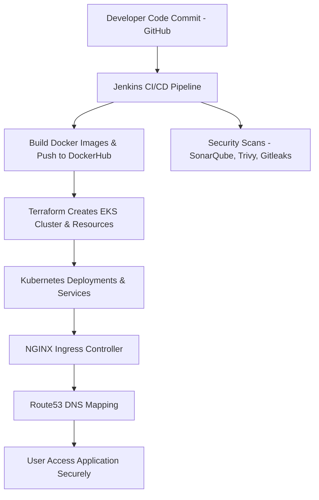

# 3-Tier DevSecOps Mega Project on AWS EKS


## 📌 Project Overview
This project implements a **3-Tier DevSecOps architecture** deployed on **Amazon EKS** using an **Ingress Controller** for routing.  
It follows the **DevSecOps** pipeline, integrating CI/CD, container security, and Kubernetes deployment automation.

The project is inspired by **[jaiswaladi246](https://github.com/jaiswaladi246)** and based on his  
[YouTube Playlist](https://youtube.com/playlist?list=PLAdTNzDIZj_8bL9tHTXma8Lk89ygTvi6D&si=gcpnuH5XHTXbxBSX).  
All steps were implemented and tested hands-on by me.

---

## 🏗️ Architecture
The 3-tier architecture consists of:
1. **Frontend** – React-based UI.
2. **Backend API** – Node.js application.
3. **Database** – MySQL.

All components are containerized, scanned for vulnerabilities, and deployed to Kubernetes.


---

## 🔹 Features
- **CI/CD Pipeline** with Jenkins
- **Security Scans** using SonarQube, Trivy, and OWASP Dependency Check
- **Docker Containerization** of all components
- **Kubernetes Deployment** on AWS EKS
- **Ingress Controller** for routing

---

## 🚀 Deployment Steps
### 1️⃣ Clone the Repository
```bash
git clone https://github.com/udaychopade27/3-Tier-DevSecOps-Mega-Project.git
cd 3-Tier-DevSecOps-Mega-Project
```
### 2️⃣ Infrastructure Setup
Provision AWS EKS Cluster using Terraform.

Configure kubectl to connect to the cluster.

Deploy Nginx Ingress Controller.

### 3️⃣ CI/CD Pipeline
Configure Jenkins pipeline with the following stages:

Source Code Checkout

Code Quality Check (SonarQube)

Vulnerability Scan (Trivy)

Build & Push Docker Images

Deploy to EKS via Helm

### 4️⃣ Monitoring Setup
Deploy Prometheus & Grafana using Helm.

Configure dashboards for application and infrastructure metrics.

---

📂 Repository Structure
```text
.
📦 3-Tier-DevSecOps-Mega-Project
 ┣ 📂 backend
 ┣ 📂 frontend
 ┣ 📂 k8s-prod
 ┣ 📂 jenkins
 ┣ 📜 README.md
 ┗ 📜 Jenkinsfile
```

🙏 Acknowledgements
Special thanks to [jaiswaladi246](https://github.com/jaiswaladi246) for the amazing
[YouTube](https://youtube.com/playlist?list=PLAdTNzDIZj_8bL9tHTXma8Lk89ygTvi6D&si=qwTHSold2sfsxf8Z) Playlist that inspired and guided this project.
